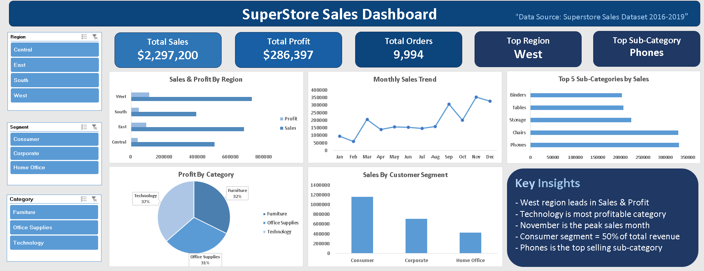

# Superstore-Sales-Dashboard

## Project Overview
Analyzed 9,994 rows of US retail sales data 
using Excel, Power Query and Pivot Tables.

## Dashboard Preview

## Tools Used
- Microsoft Excel
- Power Query
- Pivot Tables & Charts

## Key Insights
- West region leads in Sales & Profit
- Technology is most profitable category
- November is peak sales month
- Consumer segment = 50% of revenue
- Phones is top selling sub-category

## Data Source
Superstore Sales Dataset 2016-2019
